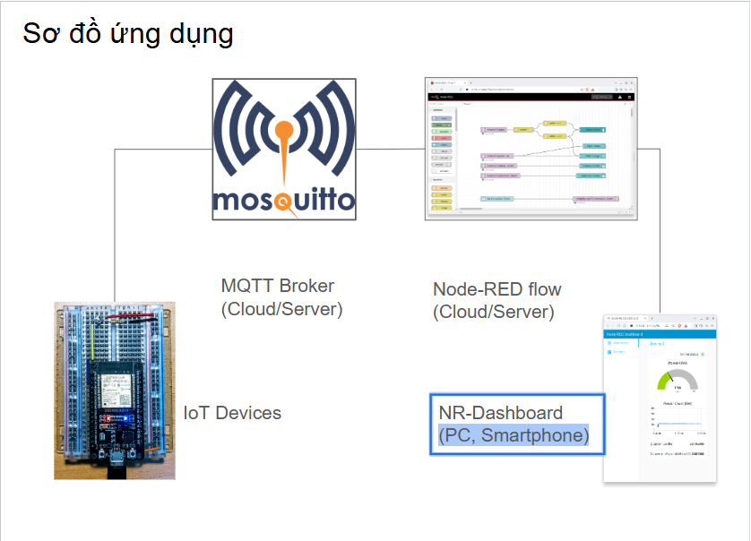
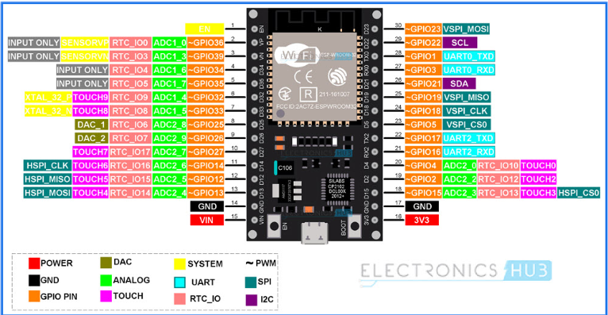
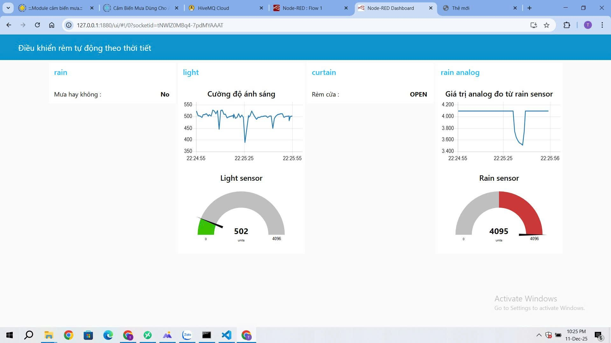

# Automatic Curtain Controller with Rain Sensor & CdS Photoresistor + IoT Dashboard on Node-Red

##  Mô tả dự án

###  Đặt vấn đề  
Thông thường hiện nay trong các hộ gia đình, rèm cửa luôn được điều khiển đóng mở thủ công — ta dễ dàng nhận ra một số vấn đề ví dụ khi trời nắng quá gắt thường không để ý, ánh nắng chiếu vào khiến nhiệt độ trong nhà tăng cao gây hiện tượng chói mắt, nóng bức, khó chịu hoặc khi trời mưa làm ướt ban công và có thế vào trong nhà gây ướt,trơn trượt; quần áo phơi không kịp cất hoặc che chắn dễ dàng bị ướt, ngấm nước mưa và ẩm mốc. Dự án này được thực hiện nhằm tự động đóng mở rèm cửa dựa theo thời tiết với mong muốn phần nào giải quyết một vài vấn đề nói trên.
Mục tiêu của dự án:

- Tự động **đóng mở rèm** dựa trên hai điều kiện:  
  - **Nắng gắt** (đo từ quang trở CdS).  
  - **Trời mưa** (đọc từ cảm biến mưa). 
  - Đồng thời tự động bật tắt đèn trong nhà (nếu có)-bật đèn trong nhà khi rèm đóng. 
- Cung cấp **bảng điều khiển giám sát từ xa** qua Internet, hiển thị: trạng thái rèm, cảm biến ánh sáng, cảm biến mưa.  
- Cho phép **xem trạng thái real-time** — thuận tiện, hiện đại và tiện ích cho người dùng.

---

##  Thành phần & Cấu trúc chung

- Phần **firmware** (ESP32):  
  - Đọc tín hiệu từ cảm biến mưa & quang trở.  
  - Điều khiển servo đóng/mở rèm.  
  - Gửi dữ liệu cảm biến, thời tiết + trạng thái rèm lên broker MQTT.  
- Phần **IoT & Node-Red Dashboard** (Backend/Frontend):  
  - Broker MQTT (HiveMQ Cloud).  
  - :contentReference[oaicite:0]{index=0} để nhận dữ liệu và hiển thị giao diện web Dashboard.  
- Cấu trúc code rõ ràng, modular — dễ mở rộng với module cảm biến, module điều khiển, module MQTT.

---

##  Sơ đồ dự án
[Cảm biến mưa] [Quang trở CdS] [Servo kéo rèm] [Đèn LED]
\ | /
\——→ [ESP32 (firmware)] ——→ MQTT Broker (HiveMQ Cloud) ——→ Node-RED flow (Cloud/Server) ——→ Node-RED Dashboard (PC, Smartphone)

## Sơ đồ hệ thống
- ESP32 đọc cảm biến → quyết định mở/đóng rèm → publish dữ liệu & trạng thái lên MQTT.  
- Node-RED subscribe các topic, hiển thị lên Dashboard để người dùng theo dõi.

### Nối chân:

#### Sơ đồ chân ESP32 sử dụng trong dự án:

#### 1. Kết nối cảm biến mưa (Rain Sensor)
| Thành phần   | Chân module  | Kết nối tới ESP32 / Nguồn |
| ------------ | ------------ | ------------------------- |
| Cảm biến mưa | VCC          | 3V3                       |
|              | GND          | GND (ESP32)               |
|              | A0 (Analog)  | GPIO33 (D33)              |
|              | D0 (Digital) | GPIO16 (RX2)              |
#### 2. Kết nối quang trở CdS (Cảm biến ánh sáng)
3V3 
 │
 ├── CdS LDR ───> GPIO39 (VN)
 │
 └── resistor 1kΩ ───> GND
| Thành phần   | Kết nối                   | Ghi chú                        |
| ------------ | ------------------------- | ------------------------------ |
| CdS LDR      | Một đầu → 3V3             |                                |
| CdS LDR      | Đầu còn lại → GPIO39 (VN) | Điện áp thay đổi theo ánh sáng |
| Điện trở 1kΩ | Một đầu → GPIO39 (VN)     |                                |
| Điện trở 1kΩ | Đầu còn lại → GND         |                                |
#### 3. Servo 360° (MG90S 360 hoặc tương đương)
| Thành phần | Chân servo | Kết nối                        |
| ---------- | ---------- | ------------------------------ |
| Servo 360° | VCC        | 5V nguồn ngoài                 |
|            | GND        | GND chung với ESP32 + nguồn 5V |
|            | PWM        | GPIO14 (D14)                   |

Lưu ý: Servo cần nguồn ngoài ít nhất 5V để hoạt động ổn định và cần nối GND chung để tín hiệu PWM ổn định.

#### 4. Đèn LED báo trạng thái
3V3 → Điện trở 1kΩ → LED → GPIO5 (D5)
| Thành phần | Kết nối                        | Ghi chú                    |
| ---------- | ------------------------------ | -------------------------- |
| LED        | Cực dương → Điện trở 1kΩ → 3V3 |                            |
| LED        | Cực âm → GPIO5 (D5)            | LED sáng khi GPIO5 kéo LOW |
---

##  Hướng dẫn sử dụng / Cài đặt

### 1. Firmware (ESP32)  
- Mở `platformio.ini` + `main.cpp`.  
- Cập nhật WiFi SSID + mật khẩu wifi bạn đang sử dụng  
- Nếu dùng broker MQTT cần TLS (ví dụ cloud MQTT như HiveMQ Cloud của mình), đảm bảo thư viện `WiFiClientSecure` + cấu hình đúng TLS/CA. (CA Certificate nằm trong file isrgrootx1.pem) 
- Upload chương trình lên ESP32.

### 2. Broker MQTT  
- Có thể dùng broker public (miễn phí) hoặc broker cloud (HiveMQ, EMQX …).  
- Nếu dùng broker cloud: nhớ bật TLS + tạo user/password.  

### 3. Node-RED Dashboard  
- Import flow `.json` có sẵn (nằm trong thư mục `Node-red/`).  
- Cấu hình MQTT Broker tương ứng (host, port, TLS nếu cần, user/pass).  
- Deploy flow.  
- Mở Dashboard: `http://<địa-chỉ-node-red>:1880/ui` để xem dữ liệu:  
  - Giá trị cảm biến mưa (Digital-yes/no và Analog) 
  - Giá trị ánh sáng (CdS)  
  - Trạng thái rèm (OPEN / CLOSE)

---

##  Ảnh, Video & Kết quả (Demo)  

- Ảnh mô hình mạch + ESP32 + cảm biến + servo
 
- Ảnh Dashboard Node-RED hiển thị dữ liệu  

- Video quay cảnh servo đóng/mở khi nắng hoặc mưa
* Khi LED báo hiệu sáng -> tức là servo quay đóng rèm, và ngược lại.
* Cảm biến mưa hoạt động dựa trên nguyên lý: Nước rơi vào board (tấm cảm biến) sẽ tạo ra môi trường dẫn điện -> quay servo đóng rèm
[demo+testRainSensor.mp4](Pic+Video/demo+testRainSensor.mp4)

* Sử dụng nguồn sáng trong video là đèn để bàn, khi cho sát lại gần quang trở -> cường độ sáng tăng -> vượt qua mốc sẽ quay servo đóng rèm
[testCds.mp4](Pic+Video/testCds.mp4)

* Node-Red Dashboard thay đổi tương ứng với gia trị các cảm biến gửi về trong quá trình thử nghiệm -> hoạt động hiển thị đã như mong muốn
[NR-Dashboard1.mp4](Pic+Video/NR-Dashboard1.mp4),
[NR-Dashboard2.mp4](Pic+Video/NR-Dashboard2.mp4)
---

##  Kết luận & Đánh giá  
- Dự án hoàn thiện đúng yêu cầu: **tự động đóng/mở rèm theo điều kiện mưa/nắng(ánh sáng)**, có **giám sát từ xa** qua MQTT + Dashboard.  
- Ưu điểm:  
  - Tự động hóa, tiện lợi cho người dùng.  
  - Kiến trúc modular — dễ mở rộng (thêm cảm biến, tính năng điều khiển từ xa, lịch tự động…).  
  - Sử dụng giao thức MQTT — dễ mở rộng thành hệ thống IoT phức hợp hơn.  
- Hạn chế / Có thể cải thiện:
  - Cần thử nghiệm điều chỉnh điều chỉnh thêm mức độ cảm nhận của cảm biến mưa theo môi trường và lựa chọn ngưỡng analog phù hợp (cảm biến hiện tại cũ và có độ nhạy thấp) 
  - Nếu servo 360°: cần tùy chỉnh thêm thời gian quay chính xác để đóng/mở theo 1 góc mong muốn.
  - Cần bảo vệ nguồn servo nếu dùng nguồn ngoài.  
  - Nếu dùng cloud MQTT: cần xử lý bảo mật & latency.  
- Hướng phát triển tiếp:  
  - Thêm giao diện điều khiển thủ công (mở/đóng bằng nút trên web).  
  - Thêm cảm biến nhiệt độ / độ ẩm / ánh sáng ngoài trời để tự động theo thời tiết.  
  - Ghi log lịch sử (đóng/mở) → phân tích thói quen / tiết kiệm điện / bảo vệ đồ đạc.  

---
## Mã của dự án NodeRED
[File json để import vào Node-Red: ](Node-red/flows.json)
- Copy bằng cách: Tải về hoặc copy code trong file sau đó vào trang Node-Red -> biểu tượng cài đặt 3 dấu gạch ngang góc trên bên phải -> Import -> Paste code hoặc load file json vừa tải về lên -> Nhấn Import.

> Nếu bạn muốn thử — hãy clone repo này và chạy theo hướng dẫn. Mình luôn hoan nghênh pull-request để mở rộng dự án 😊# IoTAppDuAnCuoiKy

